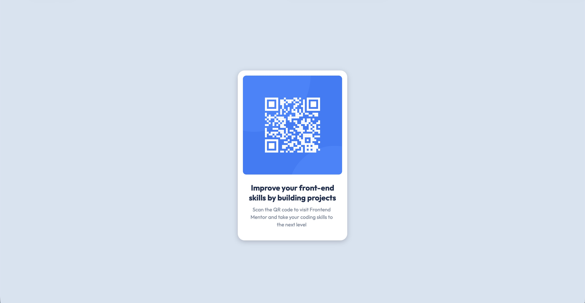

# Frontend Mentor - QR code component solution

This is my solution to the [QR code component challenge on Frontend Mentor](https://www.frontendmentor.io/challenges/qr-code-component-iux_sIO_H).  
Frontend Mentor challenges help you improve your coding skills by building realistic projects.

## Overview

### Screenshot

### Links

- Solution URL: [https://github.com/marcbrzh/fmp-qr-code](https://github.com/marcbrzh/fmp-qr-code)
- Live Site URL: [https://fmp-qr-code.netlify.app](https://fmp-qr-code.netlify.app)

## My process

### Built with

- Semantic HTML5 markup
- CSS custom properties
- Flexbox
- Mobile-first workflow

### What I learned

This was my first Frontend Mentor challenge. I practiced centering a card component both horizontally and vertically, and making sure it looks good on mobile and desktop.

### Continued development

In future projects, I want to practice more with:
- CSS Grid
- Accessibility (ARIA labels, semantic HTML)
- Using CSS variables more effectively

### Useful resources

- [MDN Web Docs - Flexbox](https://developer.mozilla.org/en-US/docs/Learn/CSS/CSS_layout/Flexbox) – Helped me understand centering.
- [Frontend Mentor Discord](https://www.frontendmentor.io/discord) – Got feedback from the community.

## Author

- Frontend Mentor - [@marcbrzh](https://www.frontendmentor.io/profile/marcbrzh)
- GitHub - [marcbrzh](https://github.com/marcbrzh)

## Acknowledgments

Thanks to the Frontend Mentor community for their feedback and support.